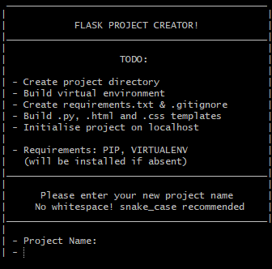

# Project Builder
###### Bash script for the easy setup of new project environments

I wrote this script to speed up the creation of new projects. I find it particularly useful when I want to quickly set up a new testing environment - either for blueprinting a fresh idea, or to experiment with something new I've learned.  

## Current Features:
- [x] Set up basic static websites.
- [x] Flask and Django projects.
- [x] Allows the inclusion of Bootstrap or jQuery.
- [x] Set up projects in a new virtual environment.

I hope to expand it to include more JS environments, as well as other languages as I learn them.

**Note: Built solely for my own use, so may not work in testing on other devices that haven't been configured accordingly.**

